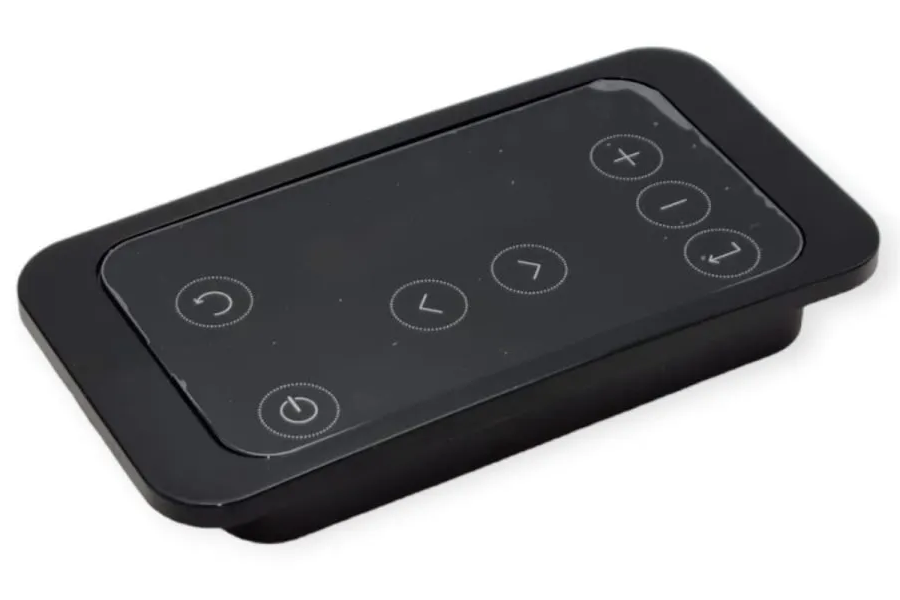

# Cbox

This project provides an API to interact through http with a `Connection Box` (a.k.a `connBox` or `cBox`) available in your LAN

:bulb: I can't manage to find direct documentation from the connbox manufacturer but basically if you have a stove with a [Fumis Controller](https://fumis.si/en/about-fumis/fumis-combustion-controllers/fumis-alpha) then you can install a `cBox` on it and this project is for you.

<p align="center">
  
</p>
<p align="center">
  
</p>

## How to

Check your python installation, `python 3.12.+` is required

```sh
python --version
# Python 3.12.4
```

Start playing around

```python
async with Cbox.connected_to(host) as cbox:
  # Fetch current cbox info
  print(await cbox.fetch_info())

  # Change cbox settings
  await cbox.change_status(Cbox.Status.OFF)
  await cbox.change_fan_setpoint(FanStatus.AUTO)
  await cbox.change_temperature_setpoint(19)
  await cbox.change_power_setpoint(4)

  # Fetch changed cbox info
  print(await cbox.fetch_info())
```

Here is the output

```json
DEBUG:cbox.connbox:Fetch infos
{"timestamp": "2024-10-20 09:41:59", "globalStatus": "CHIMNEY_ALARM", "fanSetpoint": "SPEED_1", "powerSetpoint": 1, "temperatureSetpoint": 23, "temperature1": 18.2, "temperature2": 0, "temperature3": 27, "temperature4": 0, "temperature5": 19, "firmwareDate": "2023-07-26", "firmwareVersion": 48}
DEBUG:cbox.connbox:Change status => off
DEBUG:cbox.connbox:Change fan setpoint AUTO
DEBUG:cbox.connbox:Change temperature setpoint => 19
DEBUG:cbox.connbox:Change power setpoing => 4
DEBUG:cbox.connbox:Fetch infos
{"timestamp": "2024-10-20 09:42:03", "globalStatus": "OFF", "fanSetpoint": "AUTO", "powerSetpoint": 4, "temperatureSetpoint": 19, "temperature1": 18.2, "temperature2": 0, "temperature3": 27, "temperature4": 0, "temperature5": 19, "firmwareDate": "2023-07-26", "firmwareVersion": 48}
```

## Resources

### Connobx related

[Connbox Jotul PDF](https://www.jotul.fr/sites/french/files/products/MANUAL_PELLET_CONNEXION_BOX_FR_DE_NL_ES_EN_IT_PL_P02.pdf)

[Connbox Palazetti](https://www.palazzetti-boutique-lyon.fr/nouveautes/la-nouvelle-connection-box-palazzetti/)

[Application Jotul android Pellet control](https://www.jotul.fr/sites/french/files/products/MANUAL_PELLET_CONNEXION_BOX_FR_DE_NL_ES_EN_IT_PL_P02.pdf)

### Fumis related

[Fumis Controller](https://fumis.si/en/about-fumis/fumis-combustion-controllers/fumis-alpha)

This controller is integrated by this non exhaustive list of brands :

* Palazzetti / Jotul / TurboFonte / Godin / Fonte Flamme / Invicta / Casatelli / Alpis / Faizen / HETA / ...

If you have this can of controller then you can install a connbox and use this project.

## Alternatives

[WirelessPalaControl](https://github.com/Domochip/WirelessPalaControl)

* Based on a custom connection hardware (no connbox here)
* Written in C++
* Grade A integration with HomeAssistant
* MQTT support

[hass-palazetti](https://github.com/Vost3/hass-palazzetti)

* All in one HomeAssistant integration
* Written in Python
* Grade B integration with HomeAssistant
  * It exposes a custom service and is not fully integratd as a Climate Entity

## Developer's corner

* [About Connbox protocol](doc/cboxProtcol.md)
